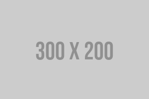

# **Information Technology Station**

O **Information Technology Station** é um portal dedicado ao acesso rápido e fácil a sistemas internos e recursos de TI, com um layout moderno e responsivo. Criado utilizando a framework **TailwindCSS**, o design foi pensado para proporcionar uma excelente experiência tanto em dispositivos móveis quanto em desktops.

---

## 🚀 **Tecnologias Utilizadas**

- **TailwindCSS** 🎨: Framework utilitário para estilização.
- **Twemoji**: Biblioteca para suportar emojis no formato adequado para a web.

---

## 📁 **Estrutura do Projeto**

Este projeto contém uma página inicial (`index.html`) com diversos **cards** de acesso para sistemas internos e ferramentas, proporcionando uma navegação intuitiva e eficiente.

---

## 📐 **Layout e Estilização**

- **Corpo da Página**: Utiliza um fundo escuro (`bg-gray-900`) e texto claro (`text-white`), garantindo contraste e legibilidade.
- **Cabeçalho**: Fixo no topo da página, com ícones rápidos de acesso a documentos e e-mails.
- **Cards de Acesso**: Cada card exibe uma imagem, uma breve descrição e um link para sistemas específicos.

---

## 🔧 **Componentes**

### **Cabeçalho**

O cabeçalho contém:

- **Ícones Tecnológicos**: Representações visuais de tecnologias como PHP, Java, React, Node.js, Python, DevOps, entre outras.
- **Links de Navegação**:
  - 📖 - Link para página de **telefones internos**.
  - 🗞️ - Link para a **caixa de entrada de e-mails** do Outlook.

### **Cards de Acesso**

Cada card oferece acesso a um sistema ou ferramenta específica da empresa. Exemplo de um card para o sistema de produção:

- **Sistema de Produção | MEU_SISTEMA** 🚀  
  **Descrição**: Acesso ao sistema **MEU_SISTEMA** de produção.  
  **URL**: [http://meusite.com](http://meusite.com)

### **Rodapé**

O rodapé exibe:

- **Direitos Autorais**: © 2024 Todos os direitos reservados.
- **Versão do Sistema**: Versão 0.0.1.

---

## 💻 **Instalação**

Para rodar o projeto localmente, siga os passos abaixo:

1. Clone o repositório para o seu ambiente local:

    ```bash
    git clone https://github.com/usuario/meusprojeto.git
    ```

2. Navegue até o diretório do projeto:

    ```bash
    cd meusprojeto
    ```

3. Abra o arquivo `index.html` em seu navegador.

---

## 🎨 **Exemplo de Layout (HTML)**

Abaixo está a estrutura do código HTML para o seu projeto, com melhorias em termos de organização e acessibilidade.

```html
        <!-- Card de Acesso 1 -->
        <div class="bg-gray-800 rounded-lg shadow-md overflow-hidden">
          <div class="p-4">
            <a href="#" target="_blank">
              
            </a>
            <p class="mt-2 text-sm text-gray-500">Sistema de Produção | MEU_SISTEMA</p>
          </div>
          <a href="#" target="_blank">
            <div class="bg-gray-700 py-2 px-4 text-center text-sm text-gray-400">meusite.com.br</div>
          </a>
        </div>

        <!-- Card de Acesso 2 -->
        <div class="bg-gray-800 rounded-lg shadow-md overflow-hidden">
          <div class="p-4">
            <a href="#" target="_blank">
              
            </a>
            <p class="mt-2 text-sm text-gray-500">Sistema Financeiro | FIN_SISTEMA</p>
          </div>
          <a href="#" target="_blank">
            <div class="bg-gray-700 py-2 px-4 text-center text-sm text-gray-400">financeiro.com.br</div>
          </a>
        </div>

        <!-- Card de Acesso 3 -->
        <div class="bg-gray-800 rounded-lg shadow-md overflow-hidden">
          <div class="p-4">
            <a href="#" target="_blank">
              
            </a>
            <p class="mt-2 text-sm text-gray-500">Sistema de RH | RH_SISTEMA</p>
          </div>
          <a href="#" target="_blank">
            <div class="bg-gray-700 py-2 px-4 text-center text-sm text-gray-400">rhempresa.com.br</div>
          </a>
        </div> 
</html>
